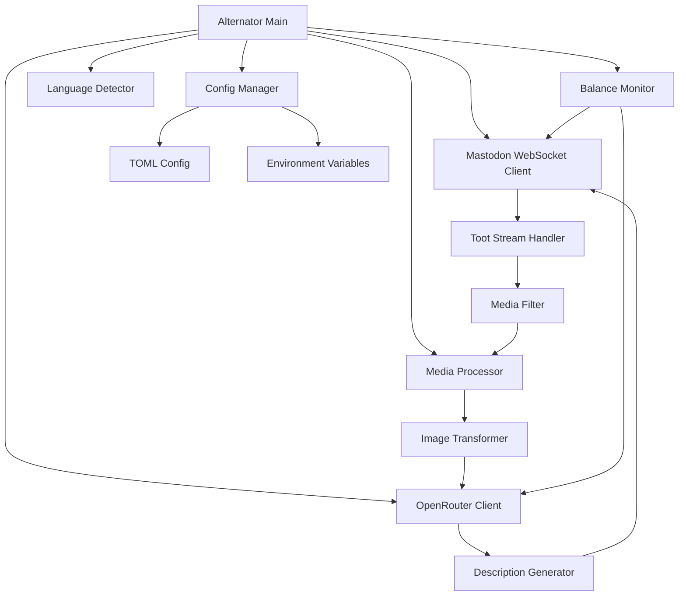

# Design Document

## Overview

Alternator is a Rust application that provides automated accessibility improvements for Mastodon posts by generating descriptions for media attachments. The system connects to Mastodon's WebSocket streaming API to monitor the authenticated user's toots in real-time, identifies images without descriptions, and uses OpenRouter's AI services to generate human-readable alt-text.

The architecture prioritizes simplicity, reliability, and maintainability while providing robust error handling and reconnection capabilities.

## Architecture

### High-Level Architecture



### Core Components

1. **Main Application Loop**: Orchestrates all components and handles graceful shutdown
2. **Configuration Manager**: Handles TOML config files and environment variable overrides
3. **Mastodon WebSocket Client**: Manages streaming connection with automatic reconnection
4. **OpenRouter Client**: Handles AI API requests with rate limiting and backoff
5. **Media Processor**: Filters and transforms media for analysis
6. **Language Detector**: Identifies toot language for localized prompts
7. **Balance Monitor**: Periodic account balance checking with notifications

## Components and Interfaces

### Configuration Manager

```rust
pub struct Config {
    pub mastodon: MastodonConfig,
    pub openrouter: OpenRouterConfig,
    pub media: MediaConfig,
    pub balance: BalanceConfig,
    pub logging: LoggingConfig,
}

pub struct MastodonConfig {
    pub instance_url: String,
    pub access_token: String,
    pub user_stream: bool,
}

pub struct OpenRouterConfig {
    pub api_key: String,
    pub model: String,
    pub base_url: String,
    pub max_tokens: Option<u32>,
}

pub struct BalanceConfig {
    pub enabled: bool,
    pub threshold: f64,
    pub check_time: String, // "12:00" format
}
```

**Responsibilities:**
- Load configuration from TOML files with XDG directory support
- Override with environment variables
- Validate configuration completeness
- Provide typed access to configuration values

### Mastodon WebSocket Client

```rust
pub struct MastodonClient {
    config: MastodonConfig,
    websocket: Option<WebSocket>,
    reconnect_attempts: u32,
}

pub trait MastodonStream {
    async fn connect(&mut self) -> Result<(), MastodonError>;
    async fn listen(&mut self) -> Result<TootEvent, MastodonError>;
    async fn get_toot(&self, toot_id: &str) -> Result<TootEvent, MastodonError>;
    async fn update_media(&self, media_id: &str, description: &str) -> Result<(), MastodonError>;
    async fn send_dm(&self, message: &str) -> Result<(), MastodonError>;
}
```

**Responsibilities:**
- Establish and maintain WebSocket connection to Mastodon streaming API
- Parse incoming toot events and filter for authenticated user's posts
- Handle reconnection with exponential backoff
- Retrieve current toot state to check for manual edits before updates
- Update media descriptions via REST API
- Send direct messages for balance notifications

### OpenRouter Client

```rust
pub struct OpenRouterClient {
    config: OpenRouterConfig,
    http_client: reqwest::Client,
    rate_limiter: RateLimiter,
}

pub trait AIDescriptionService {
    async fn describe_image(&self, image_data: &[u8], prompt: &str) -> Result<String, OpenRouterError>;
    async fn get_account_balance(&self) -> Result<f64, OpenRouterError>;
    async fn list_models(&self) -> Result<Vec<Model>, OpenRouterError>;
}
```

**Responsibilities:**
- Send image analysis requests to OpenRouter API
- Handle rate limiting and backoff strategies
- Retrieve account balance and model information
- Manage API authentication and error handling

### Media Processor

```rust
pub struct MediaProcessor {
    transformer: ImageTransformer,
    supported_formats: HashSet<String>,
}

pub trait MediaTransformer {
    fn is_supported(&self, media_type: &str) -> bool;
    fn transform_for_analysis(&self, image_data: &[u8]) -> Result<Vec<u8>, MediaError>;
    fn needs_description(&self, media: &MediaAttachment) -> bool;
}

pub struct ImageTransformer;
```

**Responsibilities:**
- Filter media attachments for supported image types
- Transform images (resize, format conversion) for OpenRouter API
- Check if media already has descriptions
- Provide abstraction for future media type support

### Language Detector

```rust
pub struct LanguageDetector {
    prompt_templates: HashMap<String, String>,
}

pub trait LanguageService {
    fn detect_language(&self, text: &str) -> String;
    fn get_prompt_template(&self, language: &str) -> &str;
}
```

**Responsibilities:**
- Detect language of toot content
- Provide language-appropriate prompts for OpenRouter
- Maintain template library for different languages

## Data Models

### Core Data Structures

```rust
#[derive(Debug, Clone)]
pub struct TootEvent {
    pub id: String,
    pub account_id: String,
    pub content: String,
    pub language: Option<String>,
    pub media_attachments: Vec<MediaAttachment>,
    pub created_at: DateTime<Utc>,
}

#[derive(Debug, Clone)]
pub struct MediaAttachment {
    pub id: String,
    pub media_type: String,
    pub url: String,
    pub description: Option<String>,
    pub meta: MediaMeta,
}

#[derive(Debug, Clone)]
pub struct MediaMeta {
    pub width: Option<u32>,
    pub height: Option<u32>,
    pub size: Option<u64>,
}
```

### Configuration Schema

```toml
[mastodon]
instance_url = "https://mastodon.social"
access_token = "your_token_here"

[openrouter]
api_key = "your_api_key_here"
model = "anthropic/claude-3-haiku"
base_url = "https://openrouter.ai/api/v1"
max_tokens = 150

[media]
max_size_mb = 10
supported_formats = ["image/jpeg", "image/png", "image/gif", "image/webp"]
resize_max_dimension = 1024

[balance]
enabled = true
threshold = 5.0
check_time = "12:00"

[logging]
level = "info"
```

## Error Handling

### Error Types

```rust
#[derive(Debug, thiserror::Error)]
pub enum AlternatorError {
    #[error("Mastodon API error: {0}")]
    Mastodon(#[from] MastodonError),
    
    #[error("OpenRouter API error: {0}")]
    OpenRouter(#[from] OpenRouterError),
    
    #[error("Media processing error: {0}")]
    Media(#[from] MediaError),
    
    #[error("Configuration error: {0}")]
    Config(#[from] ConfigError),
    
    #[error("Network error: {0}")]
    Network(#[from] reqwest::Error),
}
```

### Error Recovery Strategies

1. **WebSocket Disconnection**: Exponential backoff reconnection (1s, 2s, 4s, 8s, max 60s)
2. **API Rate Limiting**: Respect rate limit headers and implement backoff
3. **Media Processing Failures**: Log error and skip problematic media
4. **Configuration Errors**: Fail fast with clear error messages
5. **Network Timeouts**: Retry with increasing delays

## Testing Strategy

### Unit Tests

- **Configuration Manager**: Test TOML parsing, environment variable overrides, validation
- **Media Processor**: Test image filtering, transformation, format support
- **Language Detector**: Test language detection accuracy, prompt template selection
- **Error Handling**: Test all error scenarios and recovery mechanisms

### Integration Tests

- **Mastodon Client**: Mock WebSocket server for connection testing
- **OpenRouter Client**: Mock HTTP responses for API interaction testing
- **End-to-End Flow**: Test complete toot processing pipeline with mocked services

### Test Structure

```rust
#[cfg(test)]
mod tests {
    use super::*;
    
    #[tokio::test]
    async fn test_config_loading() {
        // Test configuration loading from TOML and env vars
    }
    
    #[tokio::test]
    async fn test_media_filtering() {
        // Test media type filtering and description checking
    }
    
    #[tokio::test]
    async fn test_websocket_reconnection() {
        // Test reconnection logic with mock WebSocket
    }
}
```

### Dependencies

The application will use these key Rust crates:

- **tokio**: Async runtime and utilities
- **serde**: Serialization/deserialization for JSON and TOML
- **reqwest**: HTTP client for REST API calls
- **tokio-tungstenite**: WebSocket client implementation
- **image**: Image processing and transformation
- **toml**: TOML configuration file parsing
- **tracing**: Structured logging
- **clap**: Command-line argument parsing
- **thiserror**: Error handling macros
- **chrono**: Date and time handling

All dependencies will use the latest stable versions available at implementation time.