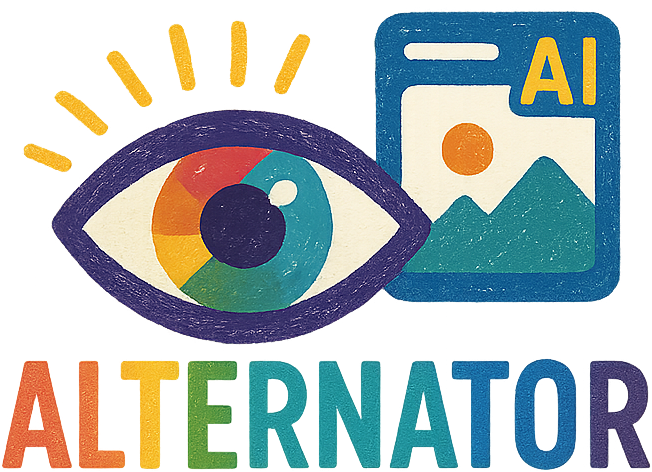

<div align="center">
  
</div>

# Alternator

Automatically adds descriptions to media attachments in Mastodon toots using AI-powered analysis for images, audio transcription, and video transcription.

[](https://github.com/rmoriz/alternator/actions)
[](https://www.gnu.org/licenses/agpl-3.0)

## Features

- **Real-time monitoring** of your Mastodon toots via WebSocket streaming
- **AI-powered media descriptions** using OpenRouter API with multiple model options:
  - **Image descriptions** for photos, graphics, and visual content
- **Audio transcription** using OpenAI Whisper CLI with GPU acceleration support
- **Video transcription** with automatic audio extraction and Whisper processing
- **Universal GPU support** - AMD ROCm and NVIDIA CUDA in a single container
- **Multi-language support** with automatic language detection and localized prompts
- **Race condition protection** to avoid overwriting manual edits
- **Cost controls** with configurable token limits and balance monitoring
- **Comprehensive error recovery** with automatic reconnection and backoff strategies
- **Container-ready** with Docker support and environment variable configuration
- **Cross-platform** binaries for Linux (glibc) and macOS (x86_64 and ARM64)
- **FFmpeg integration** for audio/video processing and format conversion

## Quick Start

### Option 1: Docker (Recommended)

Docker is the easiest way to get started as it includes all dependencies (FFmpeg, glibc) pre-installed:

```bash
# Create config and model directories
mkdir -p config whisper-models
cp alternator.toml.example config/alternator.toml

# Edit config/alternator.toml with your credentials
# Enable Whisper for audio/video transcription:
# [whisper]
# enabled = true
# model = "base"
# device = "auto"  # GPU auto-detection (rocm/cuda/cpu)

# Run with Docker (includes FFmpeg and GPU support)
docker run \
  -v $(pwd)/config:/app/config \
  -v $(pwd)/whisper-models:/app/models \
  -e ALTERNATOR_WHISPER_MODEL_DIR=/app/models \
  ghcr.io/rmoriz/alternator
```

### Option 2: Binary Installation

#### 1. Download Binary

Download the latest release for your platform from the [GitHub Releases](https://github.com/rmoriz/alternator/releases) page.

#### 2. Configuration

Copy the example configuration and customize it:

```bash
cp alternator.toml.example alternator.toml
```

Edit `alternator.toml` with your credentials:

```toml
[mastodon]
instance_url = "https://your.mastodon.instance"
access_token = "your_mastodon_access_token"

[openrouter]
api_key = "your_openrouter_api_key"
vision_model = "mistralai/mistral-small-3.2-24b-instruct:free"
text_model = "tngtech/deepseek-r1t2-chimera:free"

[whisper]
enabled = true
model = "base"
device = "auto"  # auto-detect GPU (rocm/cuda/cpu)
```

#### 3. Install FFmpeg (Required for audio/video transcription)

```bash
# macOS
brew install ffmpeg

# Ubuntu/Debian
sudo apt install ffmpeg

# Windows
# Download from https://ffmpeg.org/download.html
```

#### 4. Install Deno (Required for upcoming yt-dlp changes)

Starting soon, yt-dlp will require the Deno JavaScript runtime to handle YouTube downloads. Install it now to prepare:

```bash
# Install using the official installer (all platforms)
curl -fsSL https://deno.land/install.sh | sh

# macOS with Homebrew
brew install deno

# Add to PATH (if using curl installer)
echo 'export PATH="$HOME/.deno/bin:$PATH"' >> ~/.bashrc
source ~/.bashrc
```

#### 4. Run

```bash
./alternator --config alternator.toml
```

## Installation

### Docker (Recommended)

**⭐ Recommended approach** - includes FFmpeg and all dependencies:

```bash
# Quick start with Docker
mkdir -p config whisper-models
cp alternator.toml.example config/alternator.toml
# Edit config/alternator.toml with your credentials

docker run \
  -v $(pwd)/config:/app/config \
  -v $(pwd)/whisper-models:/app/models \
  -e ALTERNATOR_WHISPER_MODEL_DIR=/app/models \
  ghcr.io/rmoriz/alternator
```

### From Releases

Download pre-built binaries from [GitHub Releases](https://github.com/rmoriz/alternator/releases):

- `alternator-linux-amd64.tar.gz` - Linux x86_64 (glibc)
- `alternator-linux-arm64.tar.gz` - Linux ARM64 (glibc)
- `alternator-macos-amd64.tar.gz` - macOS x86_64  
- `alternator-macos-arm64.tar.gz` - macOS ARM64 (Apple Silicon)

**Linux Requirements**: glibc 2.17+ (most modern distributions including Ubuntu 16.04+, Debian 8+, CentOS 7+, Fedora 24+)

**Note**: Linux binaries are dynamically linked with glibc for broader compatibility. For static binaries or musl-based systems (Alpine Linux), build from source.

### From Source

Requires Rust 1.70.0 or later:

```bash
git clone https://github.com/rmoriz/alternator.git
cd alternator
cargo build --release
```

### Docker (Recommended)

**Why Docker?** The Docker image includes all dependencies (FFmpeg, glibc, Whisper) pre-installed, making setup much easier.

```bash
# Using GitHub Container Registry (recommended)
docker run \
  -v $(pwd)/config:/app/config \
  -v $(pwd)/whisper-models:/app/models \
  -e ALTERNATOR_WHISPER_MODEL_DIR=/app/models \
  ghcr.io/rmoriz/alternator

# Download Whisper models (optional - models are downloaded automatically when needed)
docker run \
  -v $(pwd)/config:/app/config \
  -v $(pwd)/whisper-models:/app/models \
  -e ALTERNATOR_WHISPER_MODEL_DIR=/app/models \
  ghcr.io/rmoriz/alternator --download-whisper-model base

# Build locally (if you prefer)
docker build -t alternator .
docker run \
  -v $(pwd)/config:/app/config \
  -v $(pwd)/whisper-models:/app/models \
  -e ALTERNATOR_WHISPER_MODEL_DIR=/app/models \
  alternator
```

**Docker Benefits:**
- ✅ FFmpeg pre-installed (no manual installation needed)
- ✅ All dependencies included (glibc, codecs, libraries)
- ✅ Universal GPU support (AMD ROCm + NVIDIA CUDA)
- ✅ Automatic GPU detection and optimization
- ✅ Consistent environment across all platforms
- ✅ Automatic updates with image tags
- ✅ Isolated from host system
- ✅ Persistent model storage with volume mounts

## Configuration

### Configuration File

Create `alternator.toml` based on the provided example:

```toml
[mastodon]
instance_url = "https://mastodon.social"
access_token = "your_token_here"

[openrouter]
api_key = "your_api_key_here"
vision_model = "mistralai/mistral-small-3.2-24b-instruct:free"
text_model = "tngtech/deepseek-r1t2-chimera:free"
base_url = "https://openrouter.ai/api/v1"
max_tokens = 200

[whisper]
enabled = true
model = "base"
device = "auto"          # auto-detect GPU (rocm/cuda/cpu)
preload = true           # preload model at startup for faster transcription
max_duration_minutes = 10

[balance]
enabled = true
threshold = 10.0
check_time = "12:00"

[logging]
level = "info"
```

### Backfill Feature

Alternator can process your recent toots on startup to add descriptions to media that was posted before the bot was running:

- **`backfill_count`**: Number of recent toots to process (default: 25, set to 0 to disable)
- **`backfill_pause`**: Seconds to wait between processing each toot (default: 60)

The backfill feature:
- Only processes toots with media attachments lacking descriptions
- Respects rate limits with configurable pauses
- Runs once on startup before normal stream processing
- Gracefully handles errors without stopping the application

### Environment Variables

All configuration options can be overridden with environment variables:

```bash
export ALTERNATOR_MASTODON_INSTANCE_URL="https://your.instance.com"
export ALTERNATOR_MASTODON_ACCESS_TOKEN="your_token"
export ALTERNATOR_OPENROUTER_API_KEY="your_key"
export ALTERNATOR_OPENROUTER_VISION_MODEL="mistralai/mistral-small-3.2-24b-instruct:free"
export ALTERNATOR_OPENROUTER_TEXT_MODEL="tngtech/deepseek-r1t2-chimera:free"
export ALTERNATOR_WHISPER_ENABLED="true"
export ALTERNATOR_WHISPER_MODEL="base"
export ALTERNATOR_WHISPER_MODEL_DIR="/custom/whisper/models"
export ALTERNATOR_WHISPER_DEVICE="auto"
export ALTERNATOR_WHISPER_PRELOAD="true"
export ALTERNATOR_LOG_LEVEL="debug"
```

### Getting Credentials

#### Mastodon Access Token

1. Go to your Mastodon instance
2. Navigate to **Settings** → **Development** → **New Application**
3. Create an application with these scopes:
   - `read` - Read your account information and toots
   - `write` - Update media descriptions
   - `push` - Receive notifications (for balance alerts)
4. Copy the **access token**

#### OpenRouter API Key

1. Sign up at [OpenRouter](https://openrouter.ai)
2. Add credits to your account
3. Go to [API Keys](https://openrouter.ai/keys) and create a new key
4. Copy the API key

## Supported AI Models

Popular model options for the `model` configuration:

### Free Models (Recommended to Start)
- `mistralai/mistral-small-3.2-24b-instruct:free` - Excellent free vision model with strong performance
- `qwen/qwen2.5-vl-32b-instruct:free` - Powerful free vision model with large context
- `meta-llama/llama-3.2-11b-vision-instruct:free` - Meta's free vision model
- `tngtech/deepseek-r1t2-chimera:free` - Excellent free text model for summarization tasks

### Paid Models (Higher Quality)
- `google/gemini-2.5-flash-lite` - Google's latest efficient vision model

See [OpenRouter Models](https://openrouter.ai/models) for the complete list.

## Usage

### Basic Usage

```bash
# Use config file in current directory
./alternator

# Specify config file location
./alternator --config /path/to/alternator.toml

# Set log level
./alternator --log-level debug

# Verbose mode (equivalent to --log-level debug)
./alternator --verbose

# Download Whisper models for audio/video transcription
./alternator --download-whisper-model base

# Available models: tiny, base, small, medium, large
# Models are stored in ~/.alternator/models/ by default
```

### Docker Usage (Recommended)

**Docker includes FFmpeg and all dependencies pre-installed:**

```bash
# Create config and model directories
mkdir -p config whisper-models
cp alternator.toml.example config/alternator.toml
# Edit config/alternator.toml with your credentials

# Run with Docker (everything included)
# Mount both config and model directories for persistence
docker run \
  -v $(pwd)/config:/app/config \
  -v $(pwd)/whisper-models:/app/models \
  -e ALTERNATOR_WHISPER_MODEL_DIR=/app/models \
  ghcr.io/rmoriz/alternator

# For audio/video transcription with GPU acceleration:
# [whisper]
# enabled = true
# model = "base"
# device = "auto"      # GPU auto-detection (rocm/cuda/cpu)
# preload = true       # preload model at startup
# model_dir = "/app/models"  # Maps to ./whisper-models on host
```

**Docker Benefits:**
- ✅ **Models persist between containers** with volume mount
- ✅ **Faster restarts** - no need to re-download models
- ✅ **Shared models** across multiple container instances

```bash
# Create config directory
mkdir -p config
cp alternator.toml.example config/alternator.toml
# Edit config/alternator.toml with your credentials

# Run with Docker
docker run -v $(pwd)/config:/app/config ghcr.io/rmoriz/alternator
```

### Systemd Service

Create `/etc/systemd/system/alternator.service`:

```ini
[Unit]
Description=Alternator - Mastodon Media Describer
After=network.target

[Service]
Type=simple
User=alternator
WorkingDirectory=/opt/alternator
ExecStart=/opt/alternator/alternator --config /etc/alternator/alternator.toml
Restart=always
RestartSec=10

[Install]
WantedBy=multi-user.target
```

Enable and start:

```bash
sudo systemctl enable alternator
sudo systemctl start alternator
```

## How It Works

1. **Stream Monitoring**: Connects to your Mastodon instance's WebSocket stream
2. **Toot Filtering**: Identifies your own toots with media attachments
3. **Media Processing**: Processes supported media types without descriptions:
   - **Images**: Direct AI analysis for visual description
   - **Audio**: FFmpeg conversion → Whisper transcription
   - **Video**: FFmpeg audio extraction → Whisper transcription
4. **Language Detection**: Determines the toot's language for appropriate prompts
5. **AI Description**: Sends content to OpenRouter for description/transcription
6. **Race Condition Check**: Verifies the toot hasn't been manually edited
7. **Update**: Adds the generated description to the media attachment

## Features in Detail

### Race Condition Protection

Alternator checks the current state of toots before updating to avoid overwriting manual edits:

- Fetches current toot state before processing
- Skips updates if descriptions were manually added
- Logs race condition detections for monitoring

### Balance Monitoring

Automatic monitoring of your OpenRouter account balance:

- Daily balance checks at configurable times
- Direct message notifications when balance is low
- Configurable threshold amounts
- Can be disabled if not needed

### Error Recovery

Robust error handling with automatic recovery:

- WebSocket reconnection with exponential backoff (1s to 60s max)
- API rate limit handling with proper delays
- Network timeout handling with retry mechanisms
- Graceful degradation for non-critical failures

### Audio & Video Transcription

Automatic speech-to-text for multimedia content with GPU acceleration:

- **Supported Audio**: MP3, WAV, M4A, OGG, FLAC, AAC
- **Supported Video**: MP4, WebM, QuickTime, AVI, MKV, and more
- **OpenAI Whisper CLI**: Python-based Whisper with GPU support
- **Universal GPU Support**: AMD ROCm and NVIDIA CUDA in single container
- **Automatic GPU Detection**: Runtime detection and optimization
- **Model Preloading**: Faster transcription with startup model loading
- **Language Detection**: Automatic language detection or manual configuration
- **Smart Summarization**: LLM-powered transcript summarization for long content
- **Size Limits**: Configurable file size and duration limits

### FFmpeg Integration

Alternator uses FFmpeg for audio/video processing:

- **Audio Extraction**: Extracts audio tracks from video files
- **Format Conversion**: Converts audio to optimal format for Whisper
- **Quality Optimization**: Standardizes sample rates and channels
- **Error Handling**: Graceful fallback when FFmpeg is unavailable

Generates descriptions in the detected language of your toot:

- Automatic language detection from toot content
- Language-specific prompt templates
- Fallback to English for unsupported languages
- Support for 8+ languages including English, German, French, Spanish, Italian, Dutch, Portuguese, Japanese

## Configuration Reference

### `[mastodon]` Section

| Option | Type | Required | Default | Description |
|--------|------|----------|---------|-------------|
| `instance_url` | String | Yes | - | Your Mastodon instance URL |
| `access_token` | String | Yes | - | Your Mastodon access token |
| `user_stream` | Boolean | No | `true` | Use user stream vs public timeline |

### `[openrouter]` Section

| Option | Type | Required | Default | Description |
|--------|------|----------|---------|-------------|
| `api_key` | String | Yes | - | Your OpenRouter API key |
| `vision_model` | String | No | `"mistralai/mistral-small-3.2-24b-instruct:free"` | AI model for image descriptions |
| `text_model` | String | No | `"tngtech/deepseek-r1t2-chimera:free"` | AI model for text tasks (summarization) |
| `model` | String | No | `"mistralai/mistral-small-3.2-24b-instruct:free"` | Legacy: fallback model (deprecated) |
| `base_url` | String | No | `"https://openrouter.ai/api/v1"` | OpenRouter API base URL |
| `max_tokens` | Integer | No | `200` | Maximum tokens per request |

### `[media]` Section

| Option | Type | Required | Default | Description |
|--------|------|----------|---------|-------------|
| `max_size_mb` | Float | No | `10.0` | Maximum file size to process (MB) |
| `supported_formats` | Array | No | `["image/jpeg", ...]` | Supported image formats |
| `resize_max_dimension` | Integer | No | `512` | Maximum dimension for resizing |

### `[balance]` Section

| Option | Type | Required | Default | Description |
|--------|------|----------|---------|-------------|
| `enabled` | Boolean | No | `true` | Enable balance monitoring |
| `threshold` | Float | No | `10.0` | Balance threshold for notifications |
| `check_time` | String | No | `"12:00"` | Daily check time (24-hour format) |

### `[logging]` Section

| Option | Type | Required | Default | Description |
|--------|------|----------|---------|-------------|
| `level` | String | No | `"info"` | Log level: `error`, `warn`, `info`, `debug`, `trace` |

### `[whisper]` Section

| Option | Type | Required | Default | Description |
|--------|------|----------|---------|-------------|
| `enabled` | Boolean | No | `false` | Enable audio/video transcription with Whisper |
| `model` | String | No | `"base"` | Whisper model: `tiny`, `base`, `small`, `medium`, `large` |
| `model_dir` | String | No | `"~/.alternator/models"` | Directory to store Whisper models |
| `language` | String | No | `"auto"` | Language code for transcription or `"auto"` for detection |
| `max_duration_minutes` | Integer | No | `10` | Maximum audio/video duration to process (minutes) |
| `python_executable` | String | No | `"python3"` | Python executable path with OpenAI Whisper installed |
| `device` | String | No | `"auto"` | Device preference: `auto`, `cpu`, `cuda`, `rocm` |
| `backend` | String | No | `"auto"` | Backend preference: `auto`, `cpu`, `cuda`, `rocm` |
| `preload` | Boolean | No | `true` | Preload model at startup for faster transcription |

## Troubleshooting

### Common Issues

**Connection Failed**
```
Error: Failed to connect to Mastodon WebSocket
```
- Check your `instance_url` is correct
- Verify your `access_token` has the required scopes
- Ensure your Mastodon instance supports WebSocket streaming

**Authentication Failed**
```
Error: Invalid access token
```
- Regenerate your Mastodon access token
- Check the token has `read`, `write`, and `push` scopes

**OpenRouter API Error**
```
Error: OpenRouter API request failed
```
- Verify your OpenRouter API key is correct
- Check your account has sufficient credits
- Ensure the selected model is available

**FFmpeg Not Found**
```
Error: FFmpeg is required for audio/video processing but not found
```
- Install FFmpeg for your system:
  - macOS: `brew install ffmpeg`
  - Ubuntu: `sudo apt install ffmpeg` 
  - Windows: Download from https://ffmpeg.org/download.html
- Ensure FFmpeg is in your system PATH

**Whisper Model Download Failed**
```
Error: Failed to download Whisper model
```
- Check your internet connection
- Verify disk space in model directory
- Try downloading manually: `./alternator --download-whisper-model base`

**Whisper GPU Issues**
```
Info: No GPU detected, using CPU backend
```
- This is normal if you don't have a GPU installed
- CPU transcription works but is slower than GPU
- For AMD GPUs, ensure ROCm drivers are installed
- For NVIDIA GPUs, ensure CUDA drivers and nvidia-docker are installed

**Model Preloading Failed**
```
Error: Model preloading failed
```
- Check if Python and OpenAI Whisper are properly installed
- Verify the model name is valid: `tiny`, `base`, `small`, `medium`, `large`
- Check disk space in model directory
- Try disabling preloading: set `preload = false` in config
- **For Docker users**: Ensure `ALTERNATOR_WHISPER_MODEL_DIR` is set to the container path (e.g., `/whisper` not `/srv/alternator/whisper`)

**Balance Too Low**
```
Warning: OpenRouter balance is low ($1.23)
```
- Add credits to your OpenRouter account
- Adjust the `threshold` setting if needed

### Debug Mode

Enable debug logging for troubleshooting:

```bash
./alternator --log-level debug
```

Or set in configuration:

```toml
[logging]
level = "debug"
```

### Container Troubleshooting

Check container logs:
```bash
docker logs <container_id>
```

Verify configuration and model mounting:
```bash
docker run \
  -v $(pwd)/config:/app/config \
  -v $(pwd)/whisper-models:/app/models \
  -e ALTERNATOR_WHISPER_MODEL_DIR=/app/models \
  ghcr.io/rmoriz/alternator ls -la /app/config /app/models
```

## FAQ

**Q: What's the easiest way to get started?**
A: Use Docker! It includes FFmpeg and all dependencies pre-installed. Just create config and model directories, then run: `docker run -v $(pwd)/config:/app/config -v $(pwd)/whisper-models:/app/models -e ALTERNATOR_WHISPER_MODEL_DIR=/app/models ghcr.io/rmoriz/alternator`

**Q: How much does it cost to run?**
A: Free models cost nothing! For paid models, costs depend on usage. Claude-3-Haiku typically costs $0.002-0.01 per image description. Monitor your usage via OpenRouter's dashboard.

**Q: Can I use this for free?**
A: Yes! Start with free models like `mistralai/mistral-small-3.2-24b-instruct:free` or `qwen/qwen2.5-vl-32b-instruct:free`. You only pay for OpenRouter if you choose paid models.

**Q: Which model should I use?**
A: Start with `mistralai/mistral-small-3.2-24b-instruct:free` for excellent quality at no cost. Upgrade to `anthropic/claude-3-haiku` if you need faster processing or more nuanced descriptions.

**Q: Can I use this with multiple Mastodon accounts?**
A: Currently, each Alternator instance supports one Mastodon account. Run multiple instances with different configurations for multiple accounts.

**Q: Will it overwrite descriptions I add manually?**
A: No. Alternator checks for existing descriptions and skips processing if descriptions are already present.

**Q: What image formats are supported?**
A: By default: JPEG, PNG, GIF, and WebP. You can customize this in the configuration.

**Q: What audio and video formats are supported?**
A: Audio: MP3, WAV, M4A, OGG, FLAC, AAC. Video: MP4, WebM, QuickTime, AVI, MKV, and more. Requires FFmpeg and Whisper enabled.

**Q: Does this support GPU acceleration for audio transcription?**
A: Yes! The Docker image includes both AMD ROCm and NVIDIA CUDA support. GPU detection is automatic - just set `device = "auto"` in your Whisper config. If no GPU is detected, it falls back to CPU processing.

**Q: Do I need to install anything for audio/video transcription?**
A: Yes, you need to install FFmpeg for audio/video processing. Whisper models are downloaded automatically when needed.

**Q: Can I run this on a server?**
A: Yes. Alternator is designed to run as a service. See the systemd service example above.

**Q: Is there a rate limit?**
A: Alternator respects both Mastodon and OpenRouter rate limits with automatic backoff. Default limits are usually sufficient for personal use.

## Contributing

1. Fork the repository
2. Create a feature branch
3. Make your changes
4. Add tests if applicable
5. Run the test suite: `cargo test`
6. Submit a pull request

## License

This project is licensed under the AGPL-3.0 License - see the [LICENSE](LICENSE) file for details.

## Support

- 📖 **Documentation**: This README and inline code documentation
- 🐛 **Bug Reports**: [GitHub Issues](https://github.com/rmoriz/alternator/issues)
- 💬 **Discussions**: [GitHub Discussions](https://github.com/rmoriz/alternator/discussions)
- 📧 **Security Issues**: Email security@example.com

---

**Made with ❤️ for the Mastodon community**